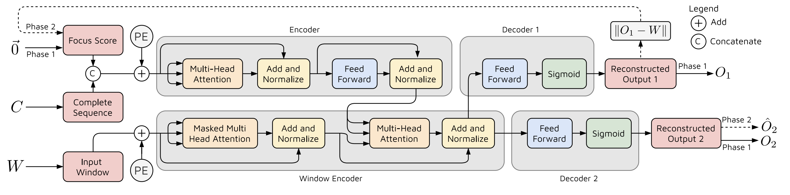
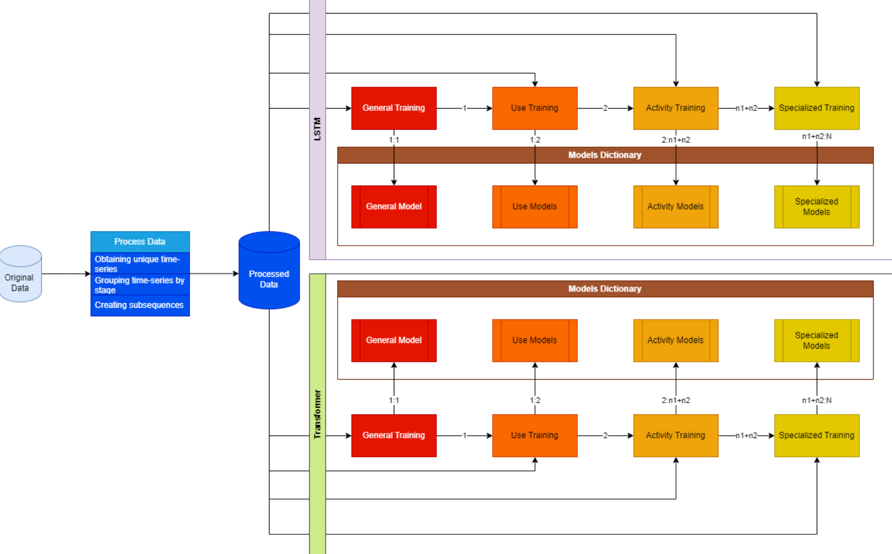
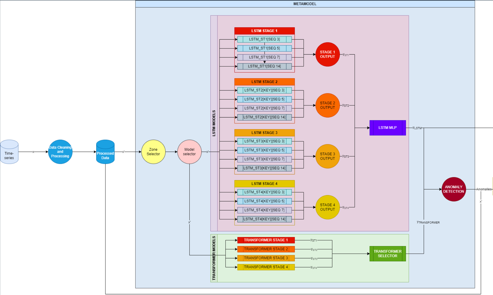
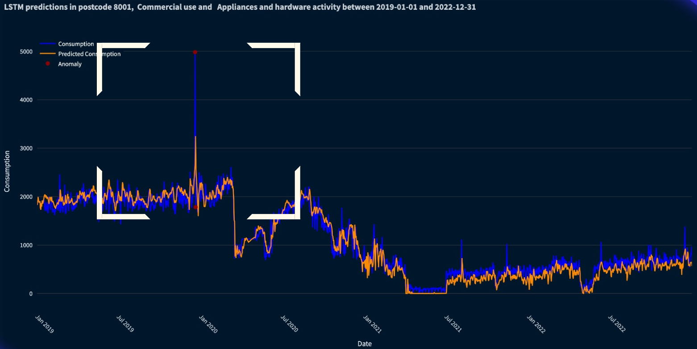
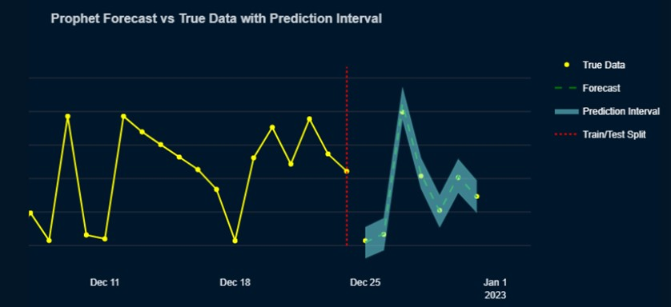
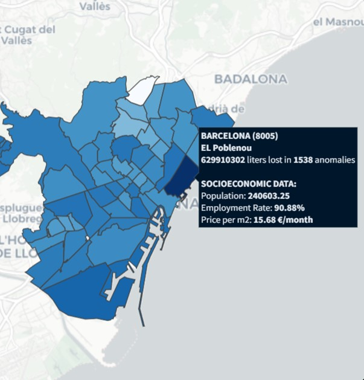

# AgBarDataChallenge
Development of an anomaly-detection hierarchical deep learning model, trained for anomaly detection in water pipeline systems.

Features: 
 - Anomaly detection
 - Consumption pattern recognition
 - Consumption Prediction
 - Web App visualization

Key parts of our meta-model: 
 - Time Series Analysis 
 - Transformer Anomaly Detection
 - LSTM
 - Prophet

This project is being used in an active contest, for confidentiality reasons, it will remain private. Contact to me if interested.

## Transformer AD architecture

## Hierarchical Training procedure

## WebApp visualization of anomaly detection using the model

## Web App visualization of our consumption prediction model

 
## Web App map visualization of the anomalies
 

